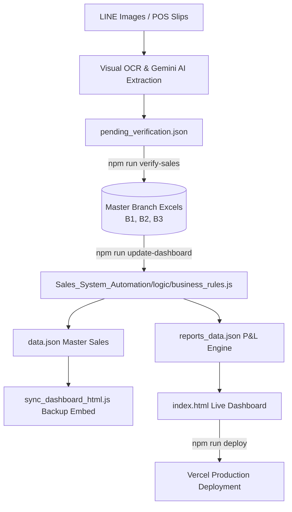

# Som Sai Jai Dashboard 🍊🥤

> **Autonomous Sales Analysis, P&L Intelligence & Financial Management System** for **Som Sai Jai** cold-press juice bar across multiple branches (B1, B2, B3).

[](https://somsaijailive.vercel.app)
[](https://nodejs.org)
[](https://ai.google.dev)
[](https://www.chartjs.org)
[](#branches--operating-model)

---

## 📌 Overview

**Som Sai Jai Dashboard** is an end-to-end sales intelligence and automated financial reporting platform for the Som Sai Jai Thai cold-press juice brand. It processes daily handwritten sales reports, POS receipts, and Thai banking transfer slips (KBank / K+) to maintain master Excel ledgers, audit daily reconciliations, allocate shared raw material costs, and generate live, interactive multi-branch management dashboards and P&L statements.

**Live Application:** [https://somsaijailive.vercel.app](https://somsaijailive.vercel.app)

---

## 🏢 Branches & Operating Model

| Branch | Description | Operating Since | Fixed Costs (Monthly) | Profit Share (Blessme / Ming) |
|---|---|---|---|---|
| **B1** | Main Branch | Jan 2026 | **฿74,000**<br>(Rent ฿35k + Salary ฿35k + Utilities ฿4k) | **70% / 30%** *(Jul 2026+)*<br>*(60% / 40% before Jul 2026)* |
| **B2** | Branch 2 | 18 Apr 2026 | **฿59,000**<br>(Rent ฿25k* + Salary ฿30k + Utilities ฿4k) | **70% / 30%** *(All periods)* |
| **B3** | Platinum Pop (Branch 3) | 11 Jul 2026 | **฿69,500**<br>(Rent ฿19k + Salary ฿46.5k [3 staff × ฿500/day × 31d] + Utilities ฿4k) | **70% / 30%** *(All periods)* |

*\*Note: B2 Rent reflects the Jul–Sep 2026 discounted rate of ฿25,000 (standard rate ฿30,000).*

---

## ⚡ Key Features

- **Multi-Branch Toggling & Consolidation:** Seamlessly switch between individual branches (`B1`, `B2`, `B3`) or aggregate data into a unified **"All Branches"** overview.
- **Multimodal AI OCR & Slip Extraction:** Processes handwritten daily tally sheets and Thai banking slips (KBank/K+) using Google Gen AI (Gemini Vision) and Swift OCR (`ocr_bin`).
- **Anti-Cheat Audit Engine:** Compares reported revenue against theoretical revenue (`sum(cup count × unit price)`) on every daily entry to catch discrepancies.
- **Hybrid COGS Allocation (ADR 0001):**
  - **Fruit COGS:** Allocated proportionally by **actual usage count** across branches. For POS-only reporting branches (such as B3), raw material consumption is derived from product sales mix.
  - **Packaging, Ice & Shared Rental:** Allocated proportionally by **revenue share** or explicitly partitioned (e.g. ฿12,000 stock storage rent split ฿4,000 per branch).
- **Quarantined Net Loss Carry-Forward (ADR 0002):** Branch losses are isolated per-branch and carried forward to offset future profits of that specific branch only.
- **OPEX Rental Separation:** Rental expenses are strictly segmented from general operating expenses (Other OPEX) in P&L reporting.
- **Mobile-Responsive Glassmorphism UI:** Complete dark/light theme support, responsive slide-out navigation, interactive Chart.js visualizations, and 8-section management reports.

---

## 🔄 Data Architecture & Workflow



> [!IMPORTANT]
> **Source of Truth:** Master Excel files (`SomSaiJai_Dashboard_B1_2026.xlsx`, `_B2_`, `_B3_`) are the only source of truth. Never edit `data.json` or `reports_data.json` directly, as they are fully overwritten during the build/sync process.

---

## 🤖 Autonomous 4-Agent Pipeline

The system includes a 4-agent autonomous pipeline orchestrator (`Sales_System_Automation/agents/Orchestrator.js`):

1. **`ImageExtractorAgent`:** Ingests raw sales photos / slips, running OCR and Gemini Vision extraction to generate structured data.
2. **`DataSyncAgent`:** Formats, validates, and stages extracted records into `pending_verification.json`, then commits verified entries to Excel.
3. **`QADeployerAgent`:** Runs regression tests, verifies financial invariants, regenerates `data.json` and `reports_data.json`, and triggers Vercel deployment.
4. **`DocGenAgent`:** Generates summary documentation and audit logs.

```bash
cd 3_Automation_Dashboard
npm run pipeline ../B1/1_Sale/Jul26/LINE_ALBUM_xxxx.jpg
```

---

## 📂 Project Structure

```
Somsaijai-Dashboard/
├── B1/                                  # Branch 1 Raw Assets (since Jan 2026)
│   ├── 1_Sale/<Month>/                  # Handwritten daily sales photos (.jpg)
│   └── 2_Expenses/<Month>/              # Expense receipts & slip images
├── B2/                                  # Branch 2 Raw Assets (since Apr 2026)
│   ├── 1_Sale/<Month>/                  # Handwritten daily sales photos (.jpg)
│   └── 2_Expenses/<Month>/              # Expense receipts & slip images
├── B3/                                  # Branch 3 Raw Assets - Platinum Pop (since Jul 2026)
│   ├── 1_Sale/<Month>/                  # Daily sales photos / POS revenue summaries
│   └── 2_Expenses/<Month>/              # Expense receipts & slip images
├── 3_Automation_Dashboard/              # Core Application & Automation Engine
│   ├── index.html                       # Live Production Dashboard (Vanilla JS + Chart.js)
│   ├── SomSaiJai_Dashboard.html         # Offline backup mirror with embedded BUILT_IN data
│   ├── SomSaiJai_Dashboard_B1_2026.xlsx # Source of Truth: Branch 1
│   ├── SomSaiJai_Dashboard_B2_2026.xlsx # Source of Truth: Branch 2
│   ├── SomSaiJai_Dashboard_B3_2026.xlsx # Source of Truth: Branch 3
│   ├── data.json                        # Consolidated normalized sales & expense data
│   ├── reports_data.json                # Pre-calculated P&L, COGS, and audit rollups
│   ├── stock_ledger.json                # Global inventory pool ledger
│   ├── pending_verification.json        # Staging queue for OCR extractions
│   ├── test_expense_rules.js            # Business rule validation & accounting tests
│   ├── test_render_finance.js           # UI financial rendering sandbox test suite
│   ├── vercel.json                      # Deployment routing & cache configuration
│   ├── package.json                     # Node.js dependencies and scripts
│   └── Sales_System_Automation/         # Core Processing Modules
│       ├── logic/
│       │   └── business_rules.js        # Single source of truth for P&L math & rules
│       ├── agents/                      # 4-Agent Autonomous Orchestration Pipeline
│       │   ├── Orchestrator.js          # Pipeline runner
│       │   ├── ImageExtractorAgent.js   # Multimodal extraction agent
│       │   ├── DataSyncAgent.js         # Staging and verification sync
│       │   ├── QADeployerAgent.js       # QA audit and deployment runner
│       │   └── DocGenAgent.py           # Documentation generator
│       ├── process_expenses.js          # Thai slip OCR parser (KBank/K+)
│       └── ocr-sales-dashboard/scripts/ # Processing & Excel synchronization scripts
├── docs/                                # Reference templates and documentation
├── CLAUDE.md                            # Guidelines for Claude agent
├── AGENTS.md                            # Agent instructions & business rules
└── README.md                            # Repository Documentation
```

---

## 🛠️ CLI & Automation Commands

All commands are executed from the `3_Automation_Dashboard/` directory:

### 1. Sales & Expense Ingestion
```bash
# Extract daily sales from handwritten report images
npm run process-sales Jul26 B1
npm run process-sales Jul26 B2
npm run process-sales Jul26 B3

# Extract expense receipts and transfer slips (Thai KBank/K+)
npm run process-expenses B1
npm run process-expenses B2
npm run process-expenses B3

# Commit verified staging entries (pending_verification.json) into Branch Excels
npm run verify-sales
```

### 2. Dashboard Build & Deployment
```bash
# Full sync: Excels -> data.json -> reports_data.json -> SomSaiJai_Dashboard.html -> Vercel Deploy
npm run update-dashboard

# Rebuild and verify data locally without deploying to Vercel
npm run update-dashboard -- --no-deploy

# Deploy current build directly to Vercel Production
npm run deploy
```

### 3. Inventory & Shared Stock Management
```bash
# Record stock in / purchase into the central pool
npm run stock-in orange 50

# Audit central stock consumption vs. physical balance
npm run audit-stock
```

### 4. Automated Testing
```bash
# Run full test suite (financial rules + UI rendering sandbox)
npm test

# Run individual test suites
node test_expense_rules.js     # Validates profit-share separation & accounting rules
node test_render_finance.js    # Sandboxes index.html JS logic against reports_data.json
```

---

## 💼 Business & Accounting Rules

1. **Effective-Dated Profit Sharing:**
   - **Jul 2026 onward:** `70% Blessme / 30% Ming` across **all branches** (B1, B2, B3).
   - **Prior to Jul 2026:** B1 was `60% / 40%`; B2 was `70% / 30%`.
   - Rate lookups are strictly governed by `profitShareFor(branch, month)` in `business_rules.js`. Historical closed months are never retroactively recalculated.
2. **Partner Profit Distributions:**
   - Transfers representing dividend/profit-share payouts (e.g. *"ส่วนแบ่ง60เปอ"*) must **NEVER** be recorded as COGS or OPEX. They are reclassified to `bucket: EXCLUDED`, `category: Profit Distribution` (amount ฿0) to preserve true P&L integrity.
3. **Expense Categorization:**
   - **COGS (`Stock`):** Generic raw material purchases, fruit stock, cups, lids, straws, packaging, and ice.
   - **OPEX (`Rental`):** Store and stock rental fees (tracked separately).
   - **OPEX (`Other OPEX`):** Utilities, daily operational supplies, logistics, maintenance.
   - **CAPEX (`Investment`):** Long-term machinery, kiosk buildouts, signage, and major renovations only.
4. **Duplicate Expense Guard:**
   - `update-dashboard` automatically cross-checks branch, date, category, and amount to detect duplicate slip entries before compilation.

---

## 📋 Sales Verification Protocol

When processing daily sales or expense batches:

1. **Staging Review:** Extracted items are staged in `pending_verification.json`.
2. **Audit Verification:** An audit reconciliation table is verified:
   ```
   Date | Revenue | Cash | Scan | Expense | Net | Theoretical Rev | Status
   ```
3. **Discrepancy Resolution:** If the written total differs from the sum of individual cup counts, confirm whether to trust the tally breakdown or the total before writing.
4. **Excel Commit:** Run `npm run verify-sales` to push data into the respective branch Excel.
5. **Publish:** Run `npm run update-dashboard` to compile financial reports and update the live dashboard.

---

## 🔒 License & Confidentiality

Internal business intelligence and sales automation system for **Som Sai Jai** / **Blessme**. All rights reserved.
